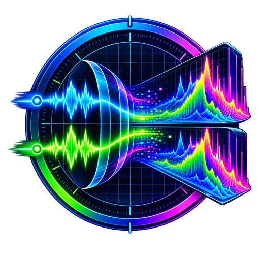

<p align="center">
  
</p>

# Realtime Spectrogram

A real-time audio spectrogram visualizer that displays frequency spectrum and spectrograms of audio loopback devices. Available in both Python and Rust implementations.

## Features

- **Real-time Visualization**: View live audio spectrograms and frequency responses
- **Dual Display Modes**: Switch between spectrogram view and frequency response view
- **Stereo Channel Support**: Separate visualization for left and right audio channels
- **Configurable Parameters**: 
  - Sample rate (8kHz to 96kHz)
  - FFT size (512 to 16384 points)
  - Frequency scale (Linear/Logarithmic)
  - Color maps (viridis, plasma, magma, inferno, turbo, cividis)
  - Dynamic range control (dB min/max)
- **Automatic Device Detection**: Automatically finds and uses audio loopback devices
- **Cross-Platform Support**: Works on Windows, Linux, and macOS (with appropriate audio setup)

## Implementations

This repository provides two implementations:

1. **Python Version** (`realtime_spectrogram.py`) - Full-featured GUI with PyQt6
2. **Rust Version** (`spectrogram-rs/`) - High-performance alternative using egui

## Installation

### Python Version

#### Requirements

- Python 3.8 or higher (PyQt6 requirement)
- Audio loopback device (varies by platform - see Platform-Specific Setup below)

#### Dependencies

Install the required Python packages:

```bash
pip install -r requirements.txt
```

The following packages will be installed:
- `numpy` - Numerical computing
- `scipy` - Signal processing (FFT windows)
- `soundcard` - Audio device access
- `pyqtgraph` - High-performance plotting
- `PyQt6` - GUI framework
- `matplotlib` - Color maps

#### Running the Python Version

```bash
python realtime_spectrogram.py
```

Or use the windowless version (no console on Windows):

```bash
pythonw realtime_spectrogram.pyw
```

### Rust Version

#### Requirements

- Rust 1.56 or higher (edition 2021, install from [rust-lang.org](https://www.rust-lang.org/))
- Audio loopback device

#### Building

```bash
# Build the Rust version
python build_rust.py
```

Or build manually:

```bash
cd spectrogram-rs
cargo build --release
```

#### Running the Rust Version

```bash
./dist/spectrogram-rs
# or on Windows:
.\dist\spectrogram-rs.exe
```

Command-line options:
```bash
spectrogram-rs --chunk 1024 --sample-rate 44100
```

## Platform-Specific Setup

### Windows

**Option 1: Using "Stereo Mix" (Realtek/Windows Audio)**
1. Right-click the speaker icon in the system tray
2. Select "Sound settings" → "Sound Control Panel"
3. Go to the "Recording" tab
4. Right-click in the empty area and enable "Show Disabled Devices"
5. Right-click "Stereo Mix" and select "Enable"
6. Set "Stereo Mix" as the default recording device (optional)

**Option 2: Using Virtual Audio Cable**
- Install VB-Audio Virtual Cable or similar software
- Configure your audio to route through the virtual cable

### Linux

**Using PulseAudio/PipeWire**

The application can typically access monitor devices automatically. If needed:

```bash
# List audio sources
pactl list sources

# Load loopback module manually (if needed)
pactl load-module module-loopback
```

For ALSA, you may need to set up a loopback device:

```bash
sudo modprobe snd-aloop
```

### macOS

macOS doesn't provide a built-in loopback device. You'll need third-party software:

**Option 1: BlackHole** (Free, recommended)
1. Download from [existential.audio/blackhole](https://existential.audio/blackhole/)
2. Install and restart
3. Create a Multi-Output Device in Audio MIDI Setup to combine BlackHole with your speakers

**Option 2: Loopback by Rogue Amoeba** (Commercial)
- More features but requires purchase

## Usage

### Python Application

1. **Start the application** - The app will automatically search for a suitable loopback device
2. **Click "Start Audio"** - Begin real-time visualization
3. **Switch Display Modes**:
   - **Spectrogram**: Shows frequency content over time with color-coded intensity
   - **Frequency Response**: Shows instantaneous frequency spectrum
4. **Open Configuration** - Click "Configuration..." to adjust:
   - Sample rate and FFT size
   - Frequency scale (Linear/Logarithmic)
   - Color map
   - Dynamic range (dB min/max)
   - Frequency response headroom
   - Verbose console output
   - Warning suppression

### Controls

- **Start Audio**: Begin capturing and visualizing audio
- **Stop Audio**: Stop the audio stream
- **Display Radio Buttons**: Toggle between Spectrogram and Frequency Response views
- **Configuration**: Access settings dialog

### Viewing

- **Left Channel**: Top spectrogram/blue line in frequency response
- **Right Channel**: Bottom spectrogram/red line in frequency response
- **Time Range**: Fixed 10-second history for spectrograms
- **Frequency Range**: Configurable, defaults to 10 Hz to Nyquist frequency

## Troubleshooting

### No Audio Device Found

**Error**: "Could not find a suitable audio loopback device"

**Solutions**:
1. Ensure a loopback device is enabled (see Platform-Specific Setup)
2. Check that the device is not in use by another application
3. Try restarting the application with administrator/root privileges
4. Enable "Verbose Console Output" in Configuration to see detailed device detection logs

### Audio Discontinuity Warnings

If you see frequent discontinuity warnings:
1. Try increasing the chunk size/FFT size in Configuration
2. Close other audio applications that might be competing for the device
3. Enable "Suppress Discontinuity Warnings" in Configuration to hide these messages

### Performance Issues

For better performance:
1. Reduce the FFT size (e.g., 1024 or 512)
2. Lower the sample rate (e.g., 22050 or 16000 Hz)
3. Consider using the Rust version for better performance
4. Close unnecessary applications

## Building Standalone Executables

### Python (PyInstaller)

A PyInstaller spec file is included:

```bash
pyinstaller realtime_spectrogram.spec
```

The executable will be created in the `dist/` directory.

### Rust

The Rust version builds a standalone executable:

```bash
python build_rust.py
```

Or:

```bash
cd spectrogram-rs
cargo build --release
```

## Technical Details

### Python Implementation

- **Audio Processing**: Runs in a separate QThread to avoid blocking the GUI
- **FFT**: Uses NumPy's FFT with scipy windows (Hann window by default)
- **Visualization**: PyQtGraph for high-performance real-time plotting
- **Update Rate**: ~25 FPS (40ms intervals) for GUI updates
- **History**: Rolling buffer maintaining 10 seconds of spectrogram data

### Rust Implementation

- **Audio Backend**: CPAL for cross-platform audio input
- **FFT**: RustFFT library
- **GUI**: egui framework for immediate mode GUI
- **Performance**: Optimized for low latency and high frame rates

## License

This project is licensed under the GNU General Public License v3.0 - see the [LICENSE](LICENSE) file for details.

Copyright © 2025 Richard M. Hamilton

## Contributing

Contributions are welcome! Please feel free to submit issues or pull requests.

## Acknowledgments

- Built with PyQt6, PyQtGraph, NumPy, and SciPy
- Rust version uses CPAL, RustFFT, and egui
- Inspired by audio analysis and music production tools
